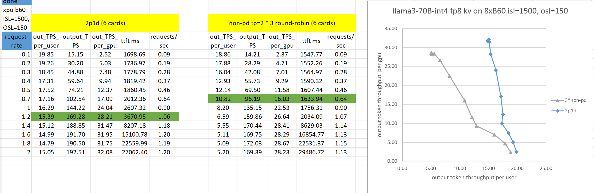

# Environment Setup

## Hardware Configuration
- 8xB60 with InfiniBand

## Build Docker Image
```bash
docker build --build-arg http_proxy=$http_proxy --build-arg https_proxy=$https_proxy -f Dockerfile.xpu -t intel/vllm-pd:latest .
```

## Run Docker Container
```bash
docker run -it -d \
    --shm-size=32g \
    --network=host \
    --name pd-test \
    --device /dev/dri \
    --device /dev/infiniband \
    -v /dev/dri/by-path:/dev/dri/by-path \
    -v /dev/infiniband:/dev/infiniband \
    -v /sys/class/net:/sys/class/net \
    -v /sys/class/infiniband_verbs:/sys/class/infiniband_verbs \
    -v /root/.cache/huggingface/:/root/.cache/huggingface/ \
    --cap-add=IPC_LOCK \
    --cap-add=CAP_SYS_PTRACE \
    --cap-add=CAP_SYS_ADMIN \
    --cap-add=CAP_SYS_RAWIO \
    --entrypoint=/bin/bash \
    --privileged \
    -e https_proxy=http://child-igk.intel.com:912 \
    -e http_proxy=http://child-igk.intel.com:912 \
    -e no_proxy="localhost,127.0.0.1" \
    intel/vllm-pd:latest
```

# PD Commands

## Prefill
```bash
export UCX_NET_DEVICES=mlx5_0:1,mlx5_1:1,mlx5_2:1,mlx5_3:1
export UCX_TLS=ib,rc,ze_copy
export UCX_MEMTYPE_CACHE=0

export ZE_AFFINITY_MASK=0,1
export model_name=ibnzterrell/Meta-Llama-3.3-70B-Instruct-AWQ-INT4
export tp_size=2

VLLM_NIXL_SIDE_CHANNEL_HOST=localhost VLLM_NIXL_SIDE_CHANNEL_PORT=5577 VLLM_WORKER_MULTIPROC_METHOD=spawn vllm serve $model_name -tp $tp_size --host localhost --port 8101 --seed 42 --enforce-eager --dtype float16 --gpu-memory-utilization 0.9 --kv-transfer-config '{"kv_connector":"NixlConnector","kv_role":"kv_both","kv_buffer_device":"xpu"}' --max-model-len 8192 --block-size 64 --no-enable-prefix-caching --kv-cache-dtype fp8
```

## Prefill2
```bash
export UCX_NET_DEVICES=mlx5_0:1,mlx5_1:1,mlx5_2:1,mlx5_3:1
export UCX_TLS=ib,rc,ze_copy
export UCX_MEMTYPE_CACHE=0

export ZE_AFFINITY_MASK=2,3
export model_name=ibnzterrell/Meta-Llama-3.3-70B-Instruct-AWQ-INT4
export tp_size=2

VLLM_NIXL_SIDE_CHANNEL_HOST=localhost VLLM_NIXL_SIDE_CHANNEL_PORT=5377 VLLM_WORKER_MULTIPROC_METHOD=spawn vllm serve $model_name -tp $tp_size --host localhost --port 8102 --seed 42 --enforce-eager --dtype float16 --gpu-memory-utilization 0.9 --kv-transfer-config '{"kv_connector":"NixlConnector","kv_role":"kv_both","kv_buffer_device":"xpu"}' --max-model-len 8192 --block-size 64 --no-enable-prefix-caching --kv-cache-dtype fp8
```

## Decode
```bash
export UCX_NET_DEVICES=mlx5_0:1,mlx5_1:1,mlx5_2:1,mlx5_3:1
export UCX_TLS=ib,rc,ze_copy
export UCX_MEMTYPE_CACHE=0

export ZE_AFFINITY_MASK=4,5
export model_name=ibnzterrell/Meta-Llama-3.3-70B-Instruct-AWQ-INT4
export tp_size=2

VLLM_NIXL_SIDE_CHANNEL_HOST=localhost VLLM_NIXL_SIDE_CHANNEL_PORT=5177 VLLM_WORKER_MULTIPROC_METHOD=spawn vllm serve $model_name -tp $tp_size --host localhost --port 8201 --seed 42 --enforce-eager --dtype float16 --gpu-memory-utilization 0.9 --kv-transfer-config '{"kv_connector":"NixlConnector","kv_role":"kv_both","kv_buffer_device":"xpu"}' --max-model-len 8192 --block-size 64 --no-enable-prefix-caching --kv-cache-dtype fp8
```

## Proxy
```bash
python3 ../toy_proxy_server.py --prefiller-hosts localhost localhost --prefiller-port 7101 7102 --decoder-host localhost --decoder-port 7201 --host localhost --port 7300 &> proxy.log &
```

## Round-Robin Proxy for N * Non-PD
```bash
python3 benchmarks/disagg_benchmarks/round_robin_proxy.py
```

## AIPerf
```bash
bash perf_aiperf.sh --prefill-tp 2 --prefill-dp 1 --decode-tp 2 --decode-dp 1 --mode disaggregated --artifacts-root-dir artifacts_2p1d_1500 --url localhost:7300 --isl 1500 --concurrency 1.2,1.4,1.6,1.8,2 --model ibnzterrell/Meta-Llama-3.3-70B-Instruct-AWQ-INT4
```

# Performance Test
Performance data of Llama3.3-70B int4 model with fp8 kvcache on 8xB60, ISL=1500, OSL=150
2P1D vs Non-PD under SLO TTFT<5s, ITL<100ms

- Serve more requests: under SLO, 2P1D achieved a request throughput of 1.06, compared to 0.64 for the Non-PD — 1.65x improvement.
- Better user experience: At a request rate of 1.2 (system saturation), the 2P1D output speed (15.39) outperformed the Non-PD setup (6.59) by 2.33x.

